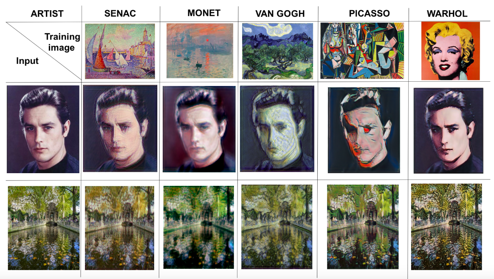

# SinGAN style transfer

This repo is a course project that aims to extend the application of the paper "SinGAN Learning a Generative Model From a Single Natural Image" [Arxiv](https://arxiv.org/pdf/1905.01164.pdf) to style transfer applications.

More details about this work can be found in the [final report](https://github.com/MathieuRita/SinGAN_styletransfer/blob/master/SinGAN_report.pdf).
